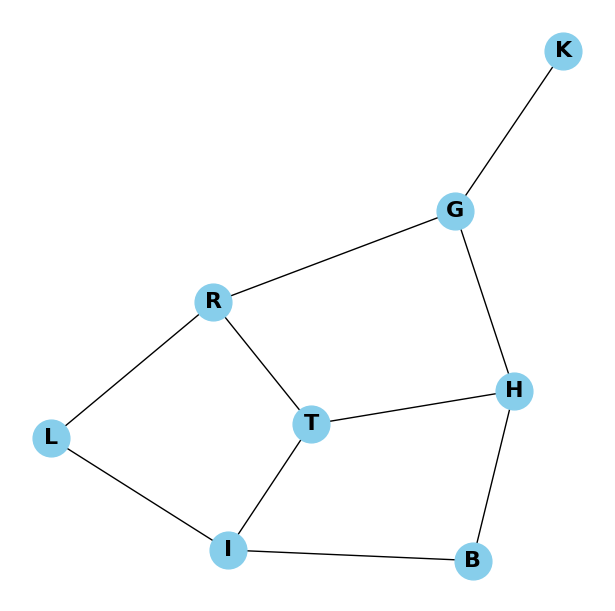

# Використання алгоритмів DFS і BFS для знаходження шляхів у графі

В якості вузлів графа ми взяли список міст, через які може пролягати популярний маршрут Київ-Буковель
В в якості ребер будуть автодороги між цими містами.

Позначимо ребра символами:
***
K - Київ \
G - Житомир \
T - Тернопіль \
R - Рівне \
H - Хмельницький \
L - Львів \
I - Івано-Франківськ \
B - Буковель 
***

Граф має вигляд:

Алгоритм DFS вираховує наступну послідовність обходу: 
### K  G  R  T  H  B  I  L
Як ми бачимо, він йде по графу послідовно заглиблюючись і переходячи між вузлами, не повертаючись назад, поки не закінчаться вузли в поточній гілці.
 

Алгоритм BFS вираховує наступну послідовність обходу: 
### K G R H L T B I
Він проходить за графом рівень за рівнем.
1. K 
2. G 
3. R H 
4. L T B 
5. I